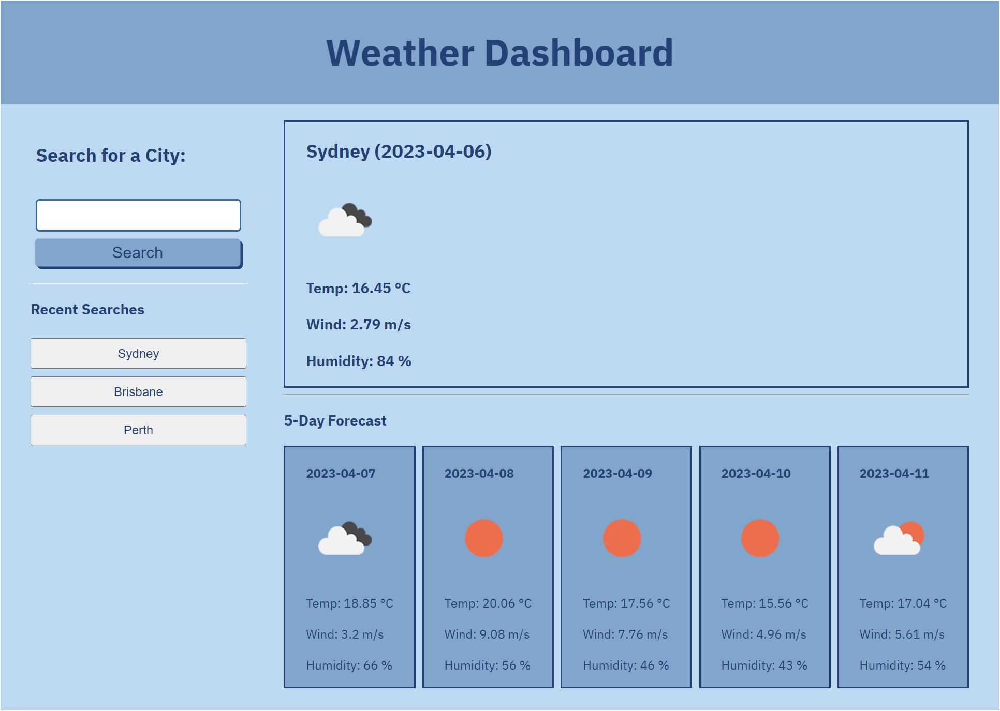

# Weather Dashboard

## Description

This application is a  Weather Dashboard where users can check weather outlook of multiple cities so that trip can be planned accordingly.

## Links

[Live Page](https://garethus.github.io/weather-dashboard/)

[GitHub Repo](https://github.com/Garethus/weather-dashboard)

## Usage

The page has two main parts, a user-input form and the weather information display. Enter the name of the city you want to check the weather and click the submit button. You will then presented with current and future conditions for that city. The name of that city is also added to the search history. 

The information about the current condition includes the city name, the date, an icon representation of weather conditions, the temperature, the humidity, and the wind speed. The information about the future conditions is a 5-day forecast that displays the date, an icon representation of weather conditions, the temperature, the humidity, and the wind speed.

When you click on a name of the city in the search history you will be presented with the current and future conditions for that city again.

    

